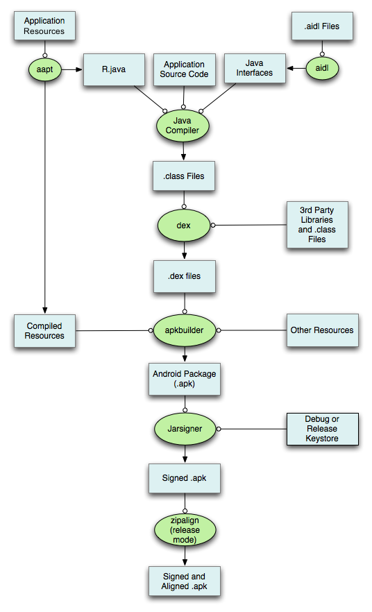

### 流程
##### 1. 打包资源文件，生成R.java文件

打包资源的工具是aapt（Android Asset Packaging Tool），位于android-sdk/platform-tools目录下。在这个过程中，项目中的AndroidManifest.xml文件和布局文件XML都会编译，然后生成相应的R.java。

##### 2. 处理AIDL文件，生成相应的Java文件

这一过程中使用到的工具是AIDL（Android Interface Definition Language），即Android接口描述语言。位于android-sdk/platform-tools目录下。AIDL工具解析接口定义文件然后生成相应的Java代码接口供程序调用。如果在项目没有使用到aidl文件，则可以跳过这一步。

##### 3. 编译项目源代码，生成class文件

项目中所有的Java代码，包括R.java和.aidl文件，都会变Java编译器（javac）编译成.class文件，生成的class文件位于工程中的bin/classes目录下。

##### 4. 转换所有的class文件，生成classes.dex文件

dx工具生成可供Android系统Dalvik虚拟机执行的classes.dex文件，该工具位于android-sdk/platform-tools 目录下。
任何第三方的libraries和.class文件都会被转换成.dex文件。dx工具的主要工作是将Java字节码转成成Dalvik字节码、压缩常量池、消除冗余信息等。

##### 5. 打包生成APK文件

所有没有编译的资源（如images等）、编译过的资源和.dex文件都会被apkbuilder工具打包到最终的.apk文件中。
打包的工具apkbuilder位于 android-sdk/tools目录下。apkbuilder为一个脚本文件，实际调用的是android-sdk/tools/lib/sdklib.jar文件中的com.android.sdklib.build.ApkbuilderMain类。

##### 6. 对APK文件进行签名

一旦APK文件生成，它必须被签名才能被安装在设备上。
在开发过程中，主要用到的就是两种签名的keystore。一种是用于调试的debug.keystore，它主要用于调试，在Eclipse或者Android Studio中直接run以后跑在手机上的就是使用的debug.keystore。另一种就是用于发布正式版本的keystore。

##### 7. 对签名后的APK文件进行对齐处理

如果你发布的apk是正式版的话，就必须对APK进行对齐处理，用到的工具是zipalign，它位于android-sdk/tools目录下。
对齐的主要过程是将APK包中所有的资源文件距离文件起始偏移为4字节整数倍，这样通过内存映射访问apk文件时的速度会更快。对齐的作用就是减少运行时内存的使用。

### 流程图

### 链接
[CSDN：Android APK打包流程](https://blog.csdn.net/wangzhongshun/article/details/96160984)
[Android Developer：构建流程](https://developer.android.google.cn/studio/build?hl=zh-cn)