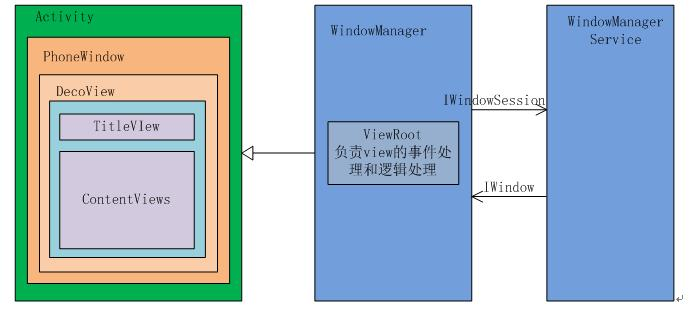

## 流程
1. 我们在setContentView会执行以下操作，创建DecorView，和主显示区域content，把我们定义的layout添加到content中

2. 在handleResumeAcitivty时，会调用WindowManager的addView，最终会调到WindowManagerGlobal的addView
3. 随后会创建ViewRootImpl，并把DecorView传入到ViewRootImpl中作为其子View，ViewRootImpl作为整个层级（Hierarchy）的最顶层
4. 随后执行Activity的makeVisible，要求重绘
5. ViewRootImpl开始遍历，先向系统请求Surface，然后执行三个绘制流程，最后把Surface传到WMS，WMS传到SurfaceFlinger显示到屏幕上

## 要点

1. ViewRootImpl作为层级的最顶层，只能有一个子View（不一定要求是DecorView，不过通常都是DecorView）

2. ViewRootImpl有一个checkThread方法，检查UI线程，注意：**检查的是创建ViewRootImpl的线程，而不一定要求是主线程，意思是UI线程不一定要求是主线程**
3. ViewRootImpl创建的时机的ActivityThread执行handleResumedActivity最后执行WindowManagerGlobal的addView
4. ViewRootImpl集成了ViewParent，和ViewGroup一样可以作为View的Parent
5. 每个Activity对应一个PhoneWindow，每个PhoneWindow对应一个WindowManagerImpl，WindowManagerGlobal是一个单例，里面有具体的实现方法

## 架构图

## 链接
[说说Activity的显示原理](https://coding.imooc.com/lesson/340.html#mid=24588)