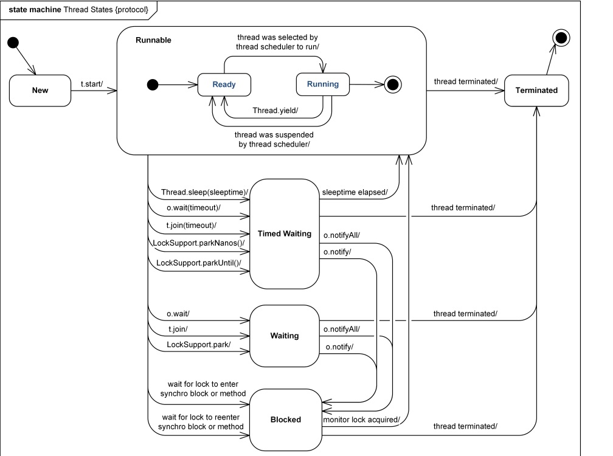

##### 1. 初始状态(New)
实现Runnable接口和继承Thread可以得到一个线程类，new一个实例出来，线程就进入了初始状态。

##### 2.1. 就绪状态(Runnable)
就绪状态只是说你资格运行，调度程序没有挑选到你，你就永远是就绪状态。
调用线程的start()方法，此线程进入就绪状态。
当前线程sleep()方法结束，其他线程join()结束，等待用户输入完毕，某个线程拿到对象锁，这些线程也将进入就绪状态。
当前线程时间片用完了，调用当前线程的yield()方法，当前线程进入就绪状态。
锁池里的线程拿到对象锁后，进入就绪状态。
##### 2.2. 运行中状态(Runnable)
线程调度程序从可运行池中选择一个线程作为当前线程时线程所处的状态。这也是线程进入运行状态的唯一一种方式。

##### 3. 阻塞状态(Blocked)
阻塞状态是线程阻塞在进入synchronized关键字修饰的方法或代码块(获取锁)时的状态。

##### 4. 等待(Waiting)
处于这种状态的线程<u>不会被分配CPU执行时间</u>，它们要等待被显式地唤醒，否则会处于无限期等待的状态。

##### 5. 超时等待(Timed Waiting)
处于这种状态的线程<u>不会被分配CPU执行时间</u>，不过无须无限期等待被其他线程显示地唤醒，在达到一定时间后它们会自动唤醒。

##### 6. 终止状态(Terminated)
当线程的run()方法完成时，或者主线程的main()方法完成时，我们就认为它终止了。这个线程对象也许是活的，但是，它已经不是一个单独执行的线程。线程一旦终止了，就不能复生。在一个终止的线程上调用start()方法，会抛出java.lang.IllegalThreadStateException异常。

### 状态图

### 链接
[知乎：Java线程中wait状态和block状态的区别?](https://www.zhihu.com/question/27654579)
[CSDN：Java中什么方法导致线程阻塞](https://blog.csdn.net/weixin_41101173/article/details/79679300)
[CSDN：Java线程的6种状态及切换\(透彻讲解\)](https://blog.csdn.net/pange1991/article/details/53860651)