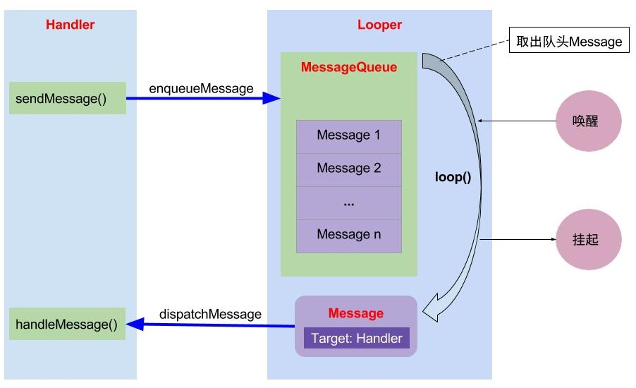

## 回答要点

1. Handler 最终都会调用 sendMessageAtTime()
2. MessageQueue 的实现是单链表
3. 要提到 Looper 在准备时到 ThreadLocal
4. 要讲到 native 层，特别是 epoll 相关的方法，以及几个 native 方法调用的时机
5. 要讲到 native 层的 MessageQueue ，native 层的 Looper

## 原理

1. **Looper**：有两个重要的方法，分别是prepare()和loop()，prepare()方法会调用构造函数，创建对应的MessageQueue和保存当前的线程，并把Looper放入ThreadLocal中；loop()方法，会无限从MessageQueue中取出消息，通过调用queue.next()的方法，当队列中没有消息时，next()会无限循环，造成阻塞，等来MessageQueue中加入新消息，然后再唤醒；Looper从队列中取到消息后，会拿到当前Message的target指向的Handler，并调用Handler的dispatchMessage()进行分发，进而调用我们重写的handleMessage或者handleCallback()。主线程的Looper在ActivityThread中被初始化和开始循环

2. **Handler**：Handler依附于创建Handler的线程，因为它持有当前线程的Looper。不论是调用post方法还是send方法，最终都会调用sendMessageAtTime(Message msg, long uptimeMillis)，然后调用Handler的enqueueMessage(Messagequeue queue, Message msg, long uptimeMillis)方法，实际调用MessageQueue的enqueueMessage(Message msg, long when)方法

3. **MessageQueue**：在Looper初始化的时候被初始化，维护着消息队列（实际是单链表的）Message mMessages，每个节点就是一个Message;

4. **Message**：作为消息队列中的一个对象，他本身就是一个节点，不需要再用Node包装，通过字段next连接下一个Message，target指向Handler，进而执行后面的消息分发

5. **ThreadLocal**：在Looper的成员变量中创建，在prepare()时，会把Looper存进ThreadLocal中，使用ThreadLocal的set()或者get()方法时，需要传入当前的线程t作为参数，ThreadLocal是属于线程的。因此get()的语义是获得属于当前线程的变量。注意：ThreadLocalMap的引用由Thread唯一持有，意思就是ThreadLocalMap跟随Thread对象一起被回收。

## 原理图

## 链接
[简书：Android消息机制的原理及源码解析](https://www.jianshu.com/p/f10)

[慕课网：Handler发送消息的Delay靠谱吗？](https://coding.imooc.com/lesson/317.html#mid=22311"%3Ehttps://coding.imooc.com/lesson/317.html)

[Android消息机制（讲得不错）](https://www.jianshu.com/p/57a426b8f145)

[Android消息机制2-Handler\(Native层\)](http://gityuan.com/2015/12/27/handler-message-native/)