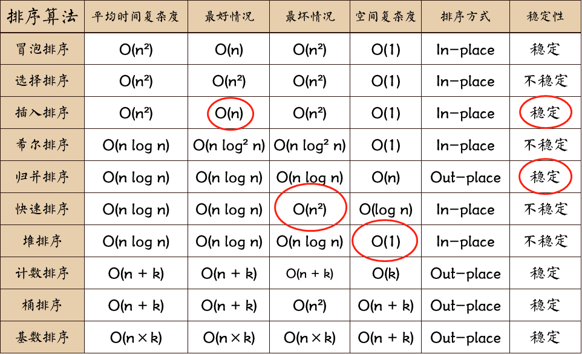

### 注意
1. O(n²)中最好的为插入排序：它稳定，且相对于同类的其他算法，速度较快，最大的优点是：**插入排序最好情况的时间复杂度是O(n)**，既只需遍历一次

2. 快速排序的最坏情况为O(n²)，即使用随机中枢快排，能最大程度的减少这个影响，且快排不稳定，Java使用的是DualPivotQuickSort双轴快排

3. 归并排序的优点在于其稳定性，缺点在于空间复杂度高，因为要复制一组数据，Java的TimeSort就是从归并排序优化，TimeSort空间复杂度为O(1)

4. 堆排序的优点在于其**空间复杂度为常量级O(1)**，在Linux Kernal中用的就是堆排序

5. 后面三种为非比较排序，使用的场景比较低(非比较排序不能使用Comparator)，且通常前面的常数很大(既单次循环的运算比较多)

6. 对于插入排序，元素越有序，时间复杂度越低，最快能达到线性，既全部有序时，希尔排序就是利用了插入排序的这个特性

### 表格
